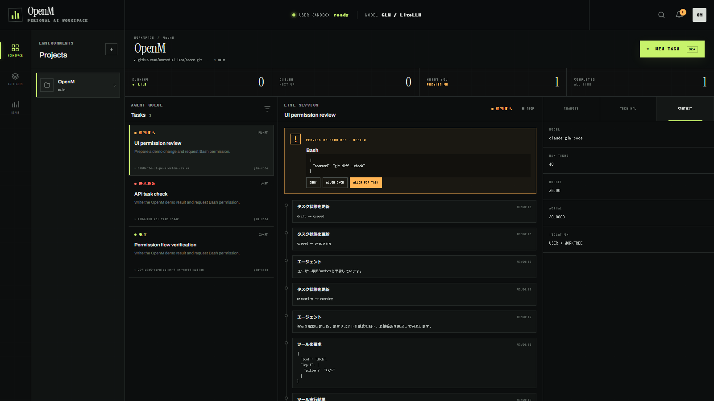
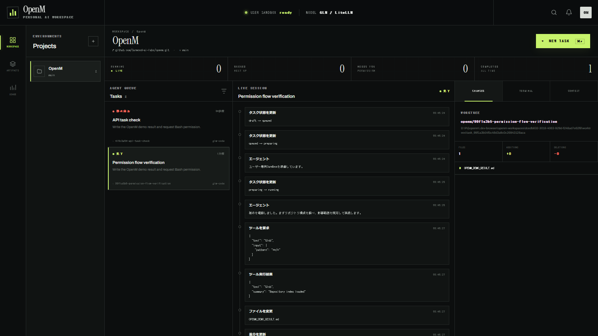
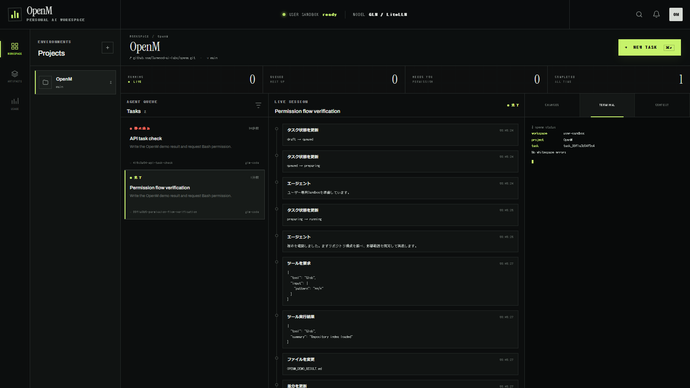
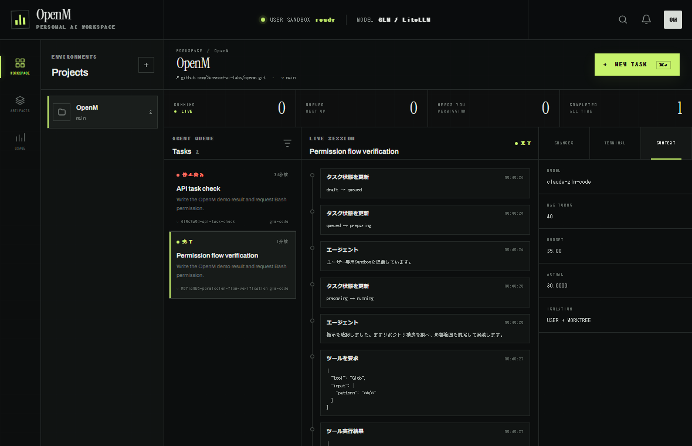
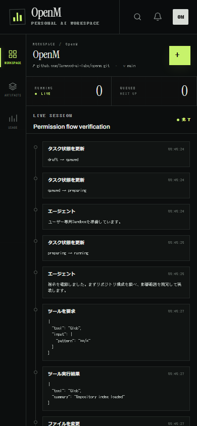

# OpenM validation report

Validated on 2026-07-29 against the development stack:

- Open WebUI base: `v0.6.5`
- OpenM package version: `0.1.0`
- Agent modes: deterministic `demo` and Claude Agent SDK `live`
- Browser: headless Chromium
- Repository: `https://github.com/Sunwood-ai-labs/openm.git`

## Verified user journey

1. Created the first administrator account and signed in.
2. Opened `/openm` without the legacy chat sidebar.
3. Connected the public OpenM repository on branch `main`.
4. Created an agent task in the user's persistent sandbox.
5. Confirmed a task-specific Git worktree and live event timeline.
6. Received a medium-risk Bash permission request.
7. Selected `ALLOW ONCE`.
8. Confirmed terminal output, successful completion, and the generated
   `OPENM_DEMO_RESULT.md` in Changes.
9. Selected another running task and confirmed `STOP` changes it to cancelled.
10. Opened Changes, Terminal, and Context inspectors.

## Visual evidence

### Permission gate



### Completed task and changed file



### Terminal inspector



### Context inspector at 1180×760



### Mobile layout at 390×844



## Layout measurements

| Viewport | Body width | Horizontal overflow |
|---|---:|---|
| 1600×900 | 1600 px | No |
| 1180×760 | 1180 px | No |
| 390×844 | 390 px | No |

## Automated checks

```text
PYTHONPATH=backend .venv/Scripts/python.exe -m pytest backend/open_webui/test/openm -q
3 passed

npm run build
completed successfully

docker compose -f docker-compose.openm.yaml config --quiet
completed successfully
```

The full inherited `npm run check` still reports pre-existing Open WebUI
type and accessibility findings outside the OpenM route. The production build
completes, and OpenM-specific markup was formatted and browser-tested.

## Defects found and fixed during validation

- Credentialed Vite-to-backend requests failed when CORS used `*`.
- Runtime SQLite updates caused Vite to reload the page continuously.
- Two task events appended in one transaction received the same sequence.
- The Changes inspector displayed hard-coded zero values.

These fixes are included in the public `main` branch.

## Live runtime and response rendering

The Claude Agent SDK `live` path was also exercised against GLM through
LiteLLM:

1. Submitted a task that created `docs/openm-demo.md` with the Write tool.
2. Confirmed the Read tool verified the resulting file.
3. Confirmed the UI reported one changed file and displayed the new-file diff.
4. Observed 47 response updates before completion; the visible response grew
   incrementally instead of appearing only after the task finished.
5. Confirmed the final response produced one `h2`, four `strong` elements,
   one unordered list, and four list items.
6. Confirmed raw `##` and `**` markers were absent from rendered text.
7. Confirmed no horizontal overflow at 390×844.

The live write task completed in 28 seconds with two tool calls. These checks
cover the OpenM task surface only; they do not generalize to every inherited
Open WebUI route.
